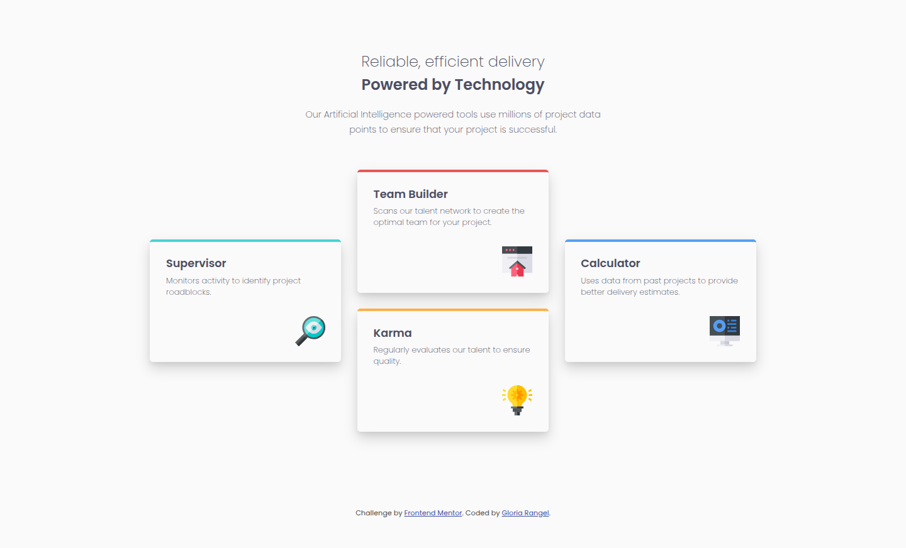
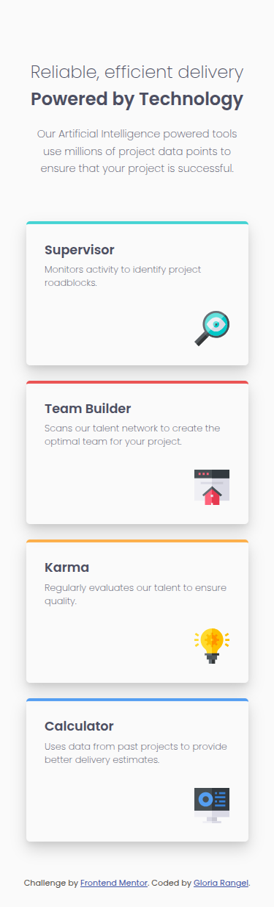

# 🖼 Frontend Mentor - Four card feature section solution

This is a solution to the [Four card feature section challenge on Frontend Mentor](https://www.frontendmentor.io/challenges/four-card-feature-section-weK1eFYK). Frontend Mentor challenges help you improve your coding skills by building realistic projects. 

##  📋 Table of contents

-  Overview

-  Screenshot

-  Links

-  My process

-  Built with

-  Useful resources

- What I learned

-  Author

-  Thanks

##  📖 Overview

This mini-project involves building a "Four Card Feature Section" that is designed to test and improve your skills in creating multi-column and responsive layouts. The goal is to recreate a section with four feature cards, ensuring it adapts beautifully to different screen sizes.

The challenge encourages you to focus on achieving the optimal layout across various devices, ensuring that the cards are displayed in an organized, visually appealing manner, regardless of the user's screen size. As a beginner-friendly task, this project allows you to practice essential layout techniques, such as using grid systems and media queries to build responsive designs.

The key features of the project include:

-  **Multi-column layout:** Using a grid layout to position the four cards efficiently.
-  **Responsive design:** Ensuring the layout adjusts for different screen sizes, allowing users to view the content comfortably on mobile, tablet, and desktop devices.
-  **Design accuracy:** Matching the layout as closely as possible to the provided design, which includes considerations for spacing, alignment, and visual hierarchy.

###  📸 Screenshot

These are the screenshots of the implemented solution:

-  **🖥️ Desktop version**

-  **📱 Mobile version**

###  ⛓️ Links

-  HTML URL: [index.html](https://github.com/NorimNori/four-card-feature-section/blob/main/index.html)

-  CSS URL: [styles.css](https://github.com/NorimNori/four-card-feature-section/blob/main/styles.css)

-  Live Site URL: [on Netlify](https://four-card-feature-section-by-gr.netlify.app/)

##  📌 My process

###  🪚 Built with

-  Semantic HTML5 markup

-  CSS custom properties

-  Flexbox

-  CSS Grid

-  Mobile-first workflow

-  BEM class naming 

-  Google fonts

###  🔬 What I learned

Through this mini-project, I gained a deeper understanding of creating responsive layouts using CSS Grid, especially the power of the `grid-template-areas` property. I learned how to structure and design a layout with multiple cards in a flexible grid system, ensuring that the content adapts seamlessly to different screen sizes.

The use of `grid-template-areas` was particularly valuable. It allowed me to visually map out the layout by assigning meaningful names to specific areas, making it much easier to position and organize elements in a way that was both intuitive and readable. This approach not only simplified my CSS code but also made it much more maintainable and easier to understand.

###  📝 Useful resources

-  [Basic concepts of flexbox](https://developer.mozilla.org/en-US/docs/Web/CSS/CSS_flexible_box_layout/Basic_concepts_of_flexbox) - This MDN article introduces **Flexbox**, a CSS layout model for creating flexible, one-dimensional designs. It covers key properties like `justify-content`, `align-items`, and `flex-direction`, helping you build responsive layouts that adapt to various screen sizes.

-  [An Interactive Guide to CSS Grid](https://www.joshwcomeau.com/css/interactive-guide-to-grid/) - Josh Comeau's guide is an interactive tutorial on **CSS Grid**, teaching you how to create two-dimensional layouts. It covers the basics of grid containers, rows, columns, and item positioning, making it easy to understand and apply Grid for responsive designs.

-  [Grid Garden](https://cssgridgarden.com/) - Grid Garden is a fun, interactive game that teaches **CSS Grid**. Through solving puzzles, you learn how to use grid properties like `grid-template-rows`, `grid-template-columns`, and `grid-gap`, building your **CSS Grid** skills step by step.

##  👋 Author

-  LinkedIn - [Gloria Rangel](https://www.linkedin.com/in/gloria-rangel-06b960306/)

-  Frontend Mentor - [@NorimNori](https://www.frontendmentor.io/profile/NorimNori)

##  🌟 Thank You 🌟

Thanks for visiting this repository! I hope you found it useful and inspiring, or it was just a fun time.

A special thanks to [Frontend Mentor](https://www.frontendmentor.io) for the challenge and for being such an amazing platform to learn and grow as a developer.

Have a nice day! 😊
